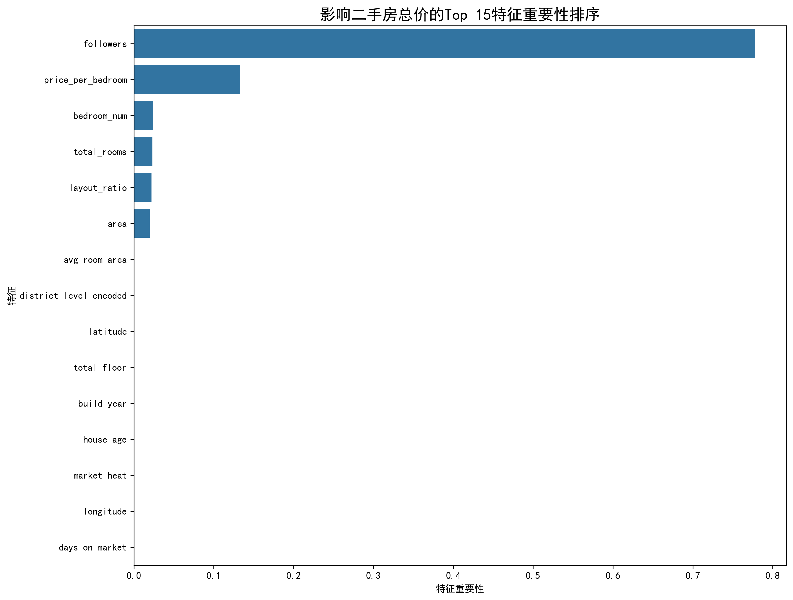

# 基于多维特征的广州市二手房价格影响因素分析与可视化

## 1. 项目背景与目标

本项目旨在应用Python数据分析技术，对广州市二手房市场的海量数据进行深度挖掘与分析。通过构建多维度特征，我们旨在识别影响房价的关键因素，并建立一个有效的价格预测模型。最终，所有分析结果将通过丰富的可视化图表进行呈现，为购房者、投资者和政策制定者提供决策支持。

**核心目标**:
- **识别关键因素**: 量化地理位置、房屋属性（面积、户型、房龄）和市场热度等因素对房价的影响。
- **构建预测模型**: 利用机器学习算法建立一个精准的房价预测模型。
- **实现数据可视化**: 通过热力图、箱线图、散点图等直观展示分析结果。

## 2. 技术栈

- **数据处理与分析**: `pandas`, `numpy`
- **数据可视化**: `matplotlib`, `seaborn`, `folium` (用于地理空间可视化)
- **机器学习**: `scikit-learn` (本项目使用 `RandomForestRegressor`)

## 3. 文件结构

```
guangzhou_house_analysis/
├── README.md                # 项目说明
├── requirements.txt         # 依赖包
├── run_preprocessing.py     # 运行数据生成与预处理
├── run_analysis.py          # 运行数据分析与建模
├── .gitignore               # Git忽略文件
├── data/
│   ├── raw/                 # 存放原始数据
│   └── processed/           # 存放处理后的数据和报告
│       └── reports/         # 存放生成的可视化图表
├── src/
│   ├── data_preprocessor.py # 数据预处理模块
│   └── analyzer.py          # 数据分析与建模模块
└── ...
```

## 4. 安装与环境配置

1.  克隆本项目到本地:
    ```bash
    git clone [你的GitHub仓库链接]
    cd guangzhou_house_analysis
    ```

2.  建议创建一个虚拟环境来管理项目依赖:
    ```bash
    python -m venv venv
    # Windows
    venv\Scripts\activate
    # macOS/Linux
    source venv/bin/activate
    ```

3.  安装所有必需的Python库:
    ```bash
    pip install -r requirements.txt
    ```
    *如果安装速度较慢，可以考虑使用国内镜像源，例如：*
    ```bash
    pip install -r requirements.txt -i https://pypi.tuna.tsinghua.edu.cn/simple
    ```

## 5. 使用说明

本项目包含两个主要执行步骤，请按顺序运行。

### **步骤一：数据生成与预处理**

运行以下命令来生成模拟的高质量数据集并进行清洗、特征工程等预处理工作。

```bash
python run_preprocessing.py
```

该脚本会自动在 `data/raw` 和 `data/processed` 目录下生成所需的数据文件。

### **步骤二：数据分析与建模**

在数据预处理完成后，运行以下命令来执行探索性数据分析、建模和可视化。

```bash
python run_analysis.py
```

脚本运行后，所有生成的分析图表将保存在 `data/processed/reports/` 目录下。

## 6. 主要发现与可视化成果

*(在这里简要描述你的主要发现，并可以贴几张最有代表性的图片)*

### **行政区房价分布**
天河区和越秀区作为市中心，房价中位数显著高于其他区域，而番禺区等外围区域价格相对较低。


### **特征重要性排序**
通过随机森林模型分析，我们发现**建筑面积 (area)** 是影响总价的最关键因素，其次是**房龄 (house_age)** 和 **区域等级 (district_level_encoded)**。


### **地理空间价格热力图**
通过Folium生成的热力图直观展示了广州市中心区域（如天河、越秀）是房价高地，而价格向外围区域递减。


